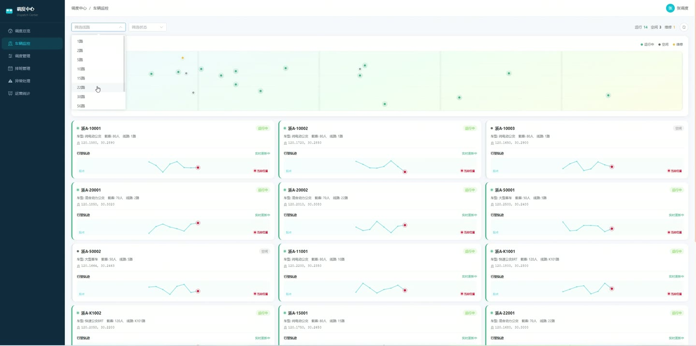
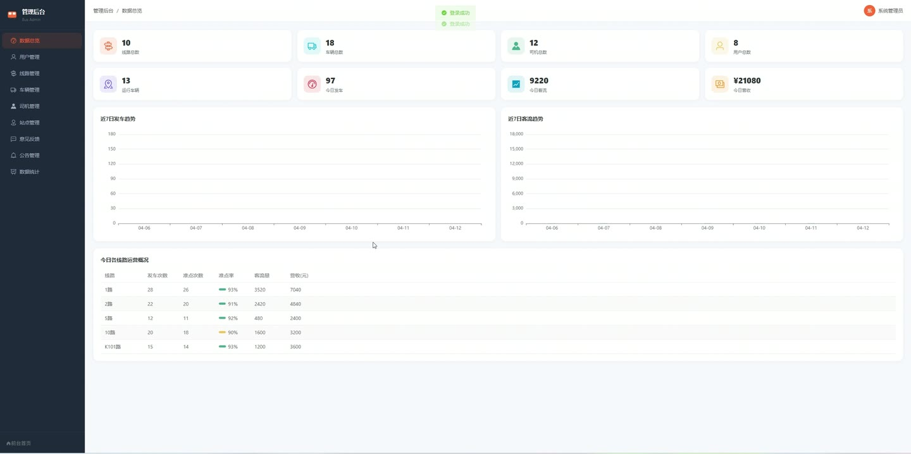
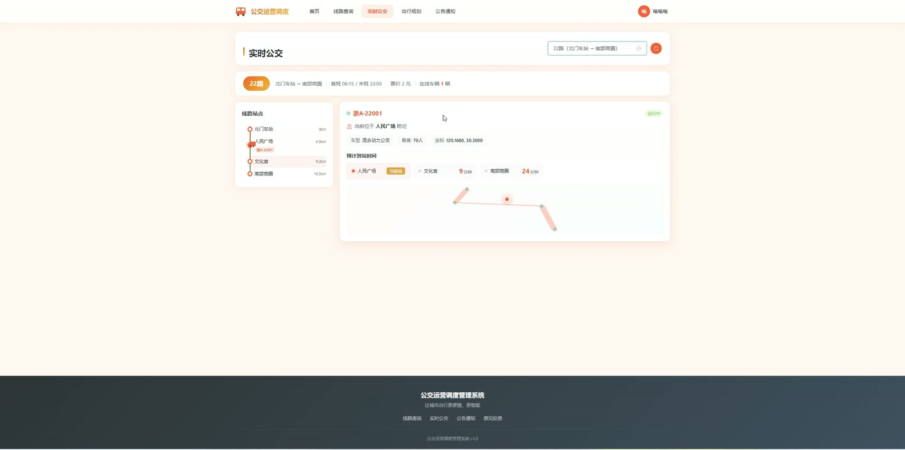
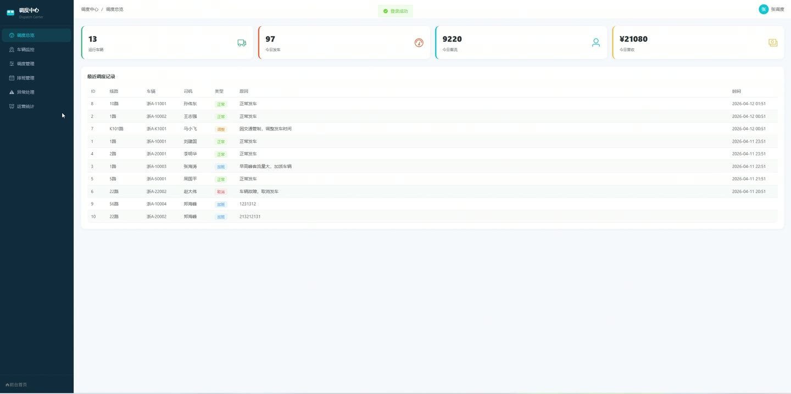
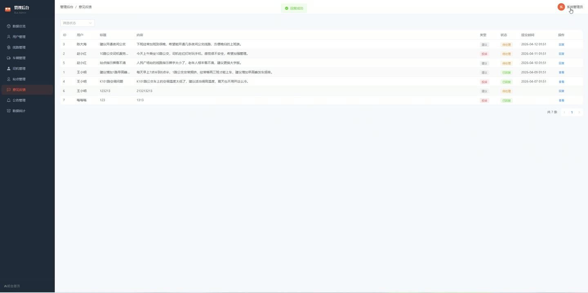

# (附文档)Springboot3+Vue3+MySQL 公交运营调度管理系统

**技术栈**：Springboot3、Vue3、MySQL

### 系统简介

本系统是一套基于 Spring Boot 3 + Vue 3 前后端分离架构的公交运营调度管理平台，覆盖乘客查询、调度指挥、后台管理三大角色。系统提供线路站点管理、车辆实时监控、智能排班调度、运营数据统计等核心业务功能，适用于公交公司日常运营管理场景。
 
### 核心功能
 
### 普通用户端

 
- 线路查询：按线路名称、起点站、终点站关键字搜索运营中的公交线路，列表按线路编号升序排列 
- 线路详情：查看单条线路的基础信息（首末班时间、票价、里程），以及按序号排列的站点列表（含经纬度、距起点距离） 
- 实时车辆位置：在地图上查看所有运行中车辆（按线路筛选），显示车牌号、车型、容量、当前经纬度 
- 出行规划：输入起点站和终点站名称，系统自动计算直达方案（途经站点数、距离、预计用时、票价）和换乘方案（换乘站点、两段线路信息、总费用） 
- 公告浏览：查看管理员发布的已启用公告列表，按发布时间倒序显示 
- 意见反馈：提交反馈工单（标题、内容、类型），查看自己提交的反馈列表及管理员回复 
- 收藏线路：收藏/取消收藏公交线路，查看已收藏的线路列表，支持检查某线路是否已被收藏 
- 个人信息管理：查看和修改个人资料（真实姓名、手机号、邮箱、头像），支持头像文件上传 
- 用户注册：填写用户名、密码、真实姓名、手机号完成注册，自动分配乘客角色 
- 快速登录：支持一键登录演示账号（乘客/调度员/管理员），方便快速体验
 
### 管理员端

 
- 仪表盘：概览线路总数、车辆总数、司机总数、用户总数、运行中车辆数，以及今日班次/乘客/营收汇总 
- 用户管理：分页查看用户列表（支持用户名/真实姓名/手机号搜索），编辑用户信息（用户名、角色、状态），启用/禁用账号，重置密码为 123456，删除用户 
- 线路管理：增删改公交线路（线路编号、名称、起终点站、首末班时间、票价、距离、状态），按关键字搜索线路 
- 站点配置：为指定线路配置站点顺序（支持批量保存 RouteStation，设置序号和距起点距离） 
- 车辆管理：增删改车辆信息（车牌号、车型、容量、所属线路、状态、购买日期、上次保养日期），按车牌号/状态/线路筛选 
- 司机管理：增删改司机信息（姓名、手机号、驾驶证号、准驾车型、状态、入职日期），按姓名或手机号搜索 
- 站点管理：增删改公交站点（站点名称、经度、纬度、地址、状态），按站点名称搜索 
- 公告管理：发布/编辑/删除公告（标题、内容、类型、启用状态），按标题关键字搜索，列表按时间倒序 
- 反馈管理：查看所有用户反馈列表（按状态筛选），回复反馈工单并标记为已完成 
- 运营统计：查看今日各线路的班次数、准点班次、准点率、乘客数、营收；查看近 N 天的运营趋势（班次、乘客、营收折线图）
 
### 调度员端

 
- 调度面板：查看线路、车辆、司机、用户总数等概览数据 
- 车辆监控：在地图上查看所有运行中车辆的实时位置，显示车牌号、车型、容量、状态、最近站点索引 
- 调度管理：新增/编辑调度记录（选择线路、车辆、司机、调度类型 NORMAL/EXTRA/CANCEL、原因），自动同步更新车辆线路和状态（NORMAL/EXTRA 设为运行中，CANCEL 设为空闲），按类型筛选记录 
- 排班管理：新增/编辑/删除排班（选择线路、车辆、司机、日期、开始/结束时间、状态），按线路和日期筛选 
- 应急处理：查看所有调度记录列表，支持按类型筛选，可快速新增应急调度 
- 运营统计：查看今日各线路的班次数、准点率、乘客数、营收，以及近 N 天趋势数据
 
### 技术栈

 后端框架Spring Boot 3.x ORMMyBatis-Plus 3.5.x 权限认证JWT（jjwt）+ 拦截器 密码加密BCryptPasswordEncoder 前端框架Vue 3（Composition API + script setup） 路由Vue Router 4（createWebHistory） 构建工具Vite 数据库MySQL 8.x 文件上传MultipartFile + 本地存储 分页插件MyBatis-Plus PaginationInnerInterceptor
 
### 交付内容

 
- 后端完整源码 
- 前端完整源码 
- 数据库初始化脚本 
- 万字文档

## 界面展示

---

## 获取完整源码 + 万字文档

本仓库为项目介绍页。**完整前后端源码、数据库初始化脚本、万字项目文档**，请加微信 `kangkangcode`，或访问 [codekk.top](http://codekk.top) 获取。

可作课程设计 / 毕业设计参考，支持远程部署调试。